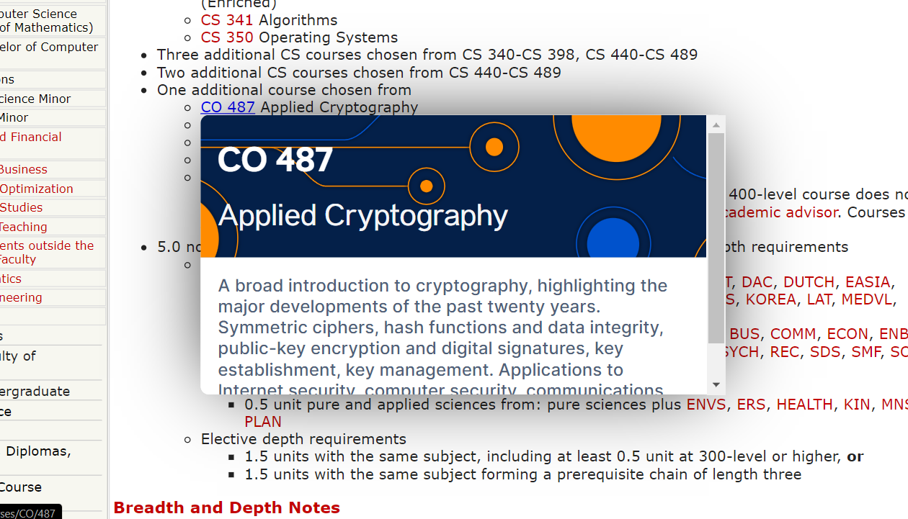

# UW Float

## Intro
This Chrome extension allows you to view information about a course from UW Flow as a link preview on the UWaterloo Undergraduate Calendar pages.

## How to Use
- Clone this repo
- Enable developer mode in the Chrome extension settings
- Select "Load Unpacked"
- Choose the "extension" folder within the repo

 
This extension is not affiliated with the University of Waterloo or UW Flow.